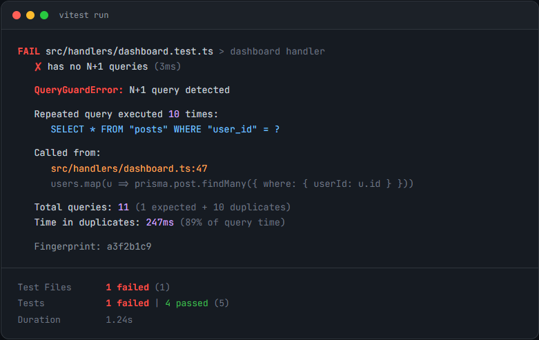

# queryguard

[](https://www.npmjs.com/package/qguard)
[](https://github.com/oniani1/queryguard/blob/master/LICENSE)

Catch N+1 queries in your tests before they hit production.

<p align="center">
  
</p>

```bash
npm install qguard
```

```ts
import { assertNoNPlusOne } from 'qguard/vitest'

test('listing users does not N+1', async () => {
  await assertNoNPlusOne(() => handler(req, res))
})
```

## Why

Every ORM makes it easy to write a loop that fires one query per row. Load 100 users, each with a profile: that's 101 queries instead of 2. The database barely notices in development, then the page takes 4 seconds in production with real data.

Ruby solved this years ago with [Bullet](https://github.com/flyerhzm/bullet). The Node.js ecosystem had nothing comparable. ORM-specific lint rules catch some patterns, but they miss raw queries, cross-ORM projects, and anything behind an abstraction layer.

queryguard works at the database driver level. It patches `pg` and `mysql2` directly. It does not care which ORM generated the SQL. If the query hits Postgres or MySQL, queryguard sees it.

## How it works

queryguard monkey-patches `pg.Client.prototype.query`, `pg.Pool.prototype.query`, and the equivalent `mysql2` methods at import time. Every query is recorded into an `AsyncLocalStorage` context scoped to your test or request. The SQL is normalized into a fingerprint (stripping literals, collapsing IN-lists), and when the same fingerprint appears more than `threshold` times outside a transaction, queryguard reports it as an N+1. No background threads, no network calls, no native modules.

## Hard numbers

| Metric | Value |
|--------|-------|
| Package size | 18 KB |
| Runtime dependencies | 0 |
| Tests | 184 |
| Overhead on Payload CMS test suite (136 tests) | 0% |
| False positives on Payload CMS | 0 |

## ORM support

| ORM | Supported | Notes |
|-----|-----------|-------|
| Prisma 7 (with `@prisma/adapter-pg`) | Yes | Prisma 7 routes queries through the `pg` driver |
| Drizzle | Yes | pg and mysql2 |
| Kysely | Yes | |
| TypeORM | Yes | pg and mysql2 |
| Knex | Yes | pg and mysql2 |
| Sequelize | Yes | pg and mysql2 |
| Raw `pg` | Yes | |
| Raw `mysql2` | Yes | Connection and Pool, query and execute |
| Prisma 6 | No | Prisma 6 uses a Rust query engine that bypasses the `pg` driver entirely |

## API

### assertNoNPlusOne

Runs a function and throws if any N+1 pattern is detected. Available from `queryguard/vitest` and `queryguard/jest`.

```ts
import { assertNoNPlusOne } from 'qguard/vitest'

test('no N+1 on user list', async () => {
  await assertNoNPlusOne(() => listUsers())
})

// With options
await assertNoNPlusOne(() => listUsers(), {
  threshold: 5,
  ignore: [/pg_catalog/],
  detectInsideTransactions: true,
})
```

### queryBudget

Sets a hard cap on total query count. Useful for endpoints where you know the exact expected query count.

```ts
import { queryBudget } from 'qguard/vitest'

test('dashboard runs at most 5 queries', async () => {
  await queryBudget(5, () => loadDashboard())
})
```

### assertScaling

Runs a function at two data cardinalities and flags any query whose count grows with the data size. Catches N+1 patterns that single-run detection misses when test fixtures have few records.

```ts
import { assertScaling } from 'qguard/vitest'

test('post list queries do not scale with data', async () => {
  await assertScaling({
    setup: async (n) => {
      await db.query('DELETE FROM posts')
      await seedPosts(n)
    },
    run: () => handler(req, res),
  })
})
```

By default, qguard runs the code with 2 records and 3 records, plus an automatic warmup run to absorb connection initialization. If any query fingerprint's count changes between the two measured runs, it's flagged as data-dependent.

Options:

```ts
await assertScaling({
  setup: (n) => seedPosts(n),
  run: () => handler(req, res),
  teardown: () => db.query('DELETE FROM posts'),  // called between runs and after the last run
  factors: [2, 3],   // default scale factors
  warmup: true,      // default, primes connections and caches
})
```

### trackQueries

Programmatic access to the detection report without throwing. Use this when you want to inspect results yourself.

```ts
import { trackQueries, install } from 'qguard'

await install()
const { result, report } = await trackQueries(() => handler(req, res))
console.log(report.detections) // Array of detected N+1 patterns
console.log(report.totalQueries) // Total query count
```

### Framework middleware

Each middleware export wraps incoming requests in an `AsyncLocalStorage` context and runs detection when the response finishes.

```ts
// Express
import { queryGuard } from 'qguard/express'
app.use(queryGuard({ mode: 'warn' }))

// Next.js (App Router)
import { withQueryGuard } from 'qguard/next'
export default withQueryGuard(handler)

// Hono
import { queryGuard } from 'qguard/hono'
app.use(queryGuard())

// Fastify
import { queryGuard } from 'qguard/fastify'
app.register(queryGuard)
```

Middleware supports three modes: `error` (throw/log error), `warn` (log warning), and `silent` (call `onDetection` callback only). Express cannot throw after a response has been sent, so `error` mode degrades to `warn` in Express.

## Configuration

```ts
import { configure } from 'qguard'

configure({
  threshold: 3,            // flag queries repeated more than 3 times (default: 2)
  ignore: [/session/, 'pg_catalog'],  // skip queries matching these patterns
  detectInsideTransactions: false,    // ignore repeated queries inside BEGIN/COMMIT (default)
  mode: 'warn',            // 'error' | 'warn' - controls middleware behavior
  verbose: true,           // extra logging (also set via QUERYGUARD_VERBOSE=1)
})
```

### Ignore blocks

The `ignore` option on `assertNoNPlusOne` matches regex/string patterns against SQL. When the noisy queries use the same SQL as the queries you want to track (test seeds, third-party middleware), use `ignore()` to suppress a code section instead:

```ts
import { ignore } from 'qguard'

await assertNoNPlusOne(async () => {
  await ignore(async () => {
    await seedTestData()       // not tracked
  })
  await handler(req, res)      // tracked
})
```

Works inside middleware contexts too. Nesting is supported. Outside a tracking context, `ignore()` is a no-op.

### Notifications

Send N+1 detections to your logging pipeline, Slack, or Sentry.

```ts
import { configure } from 'qguard'
import { loggerNotifier, slackNotifier, sentryNotifier } from 'qguard/notifiers'

configure({
  onDetection: [
    loggerNotifier(pino()),
    slackNotifier(process.env.SLACK_WEBHOOK_URL),
    sentryNotifier(Sentry),
  ],
})
```

**loggerNotifier** accepts any object with a `warn(obj, msg)` method (pino, bunyan). Emits one structured log entry per detection.

**slackNotifier** POSTs to a Slack webhook URL using native `fetch`. No-op if the URL is falsy (safe in environments without the secret).

**sentryNotifier** calls `captureMessage` with a custom fingerprint per query fingerprint, so the same N+1 across deploys groups into one Sentry issue.

By default, `notifyOnce: true` deduplicates by fingerprint hash across the process. 50 tests hitting the same N+1 produce 1 Slack message, not 50. Reset happens on `resetConfig()`.

Middleware and test integrations both fire global notifiers. Per-route middleware `onDetection` callbacks still work and fire alongside global notifiers.

### Production guard

queryguard is disabled by default when `NODE_ENV=production`. If you need it in production (for logging, not throwing), set `QUERYGUARD_FORCE=1`.

## Monorepo note

In pnpm monorepos, each workspace gets its own copy of `pg` or `mysql2`. queryguard patches the driver it can `import`, which may differ from the one your app uses. If detection is not working, pass your app's driver instance directly:

```ts
import pg from 'pg'
import { install } from 'qguard'

await install({ pg })
```

## FAQ

### Does this replace DataLoader or batching?

No. queryguard detects the problem; DataLoader fixes it. Use queryguard in tests to find N+1 patterns, then fix them with batching, DataLoader, `Promise.all`, eager loading, or whatever fits your architecture.

### What about Promise.all with duplicate queries?

By default, queryguard does not flag concurrent duplicate queries fired from `Promise.all`. These are a different performance pattern than sequential N+1 loops. If you want to catch those too, set `concurrentDuplicatesAreNPlusOne: true`.

### What is the performance cost?

On the Payload CMS test suite (136 tests), overhead was 0%. queryguard records queries into a `Map` in the current `AsyncLocalStorage` context and runs fingerprinting (string replacement, no parsing). There is no I/O, no AST, no network.

### Why does it ignore queries inside transactions?

A `BEGIN` / `COMMIT` block often contains repeated queries by design (batch inserts, migrations, seed scripts). Flagging these as N+1 produces false positives. The default is `detectInsideTransactions: false`. Override it per-test if needed.

### Is it safe in production?

queryguard is disabled when `NODE_ENV=production` unless you explicitly set `QUERYGUARD_FORCE=1`. When disabled, `install()` is a no-op and no monkey-patching occurs.

## Validation

### Logto (11.9k stars)

queryguard found 6 N+1 patterns in Logto's `GET /api/roles` endpoint. The admin console calls this on every visit to the Roles page. For each role in a paginated list of 20, the handler runs 6 individual queries: count users, find user-role relations, find users by IDs, count applications, find application-role relations, find applications by IDs. That's 122 queries per page load. The fix — four batch queries with `GROUP BY role_id` — brings it to about 8 queries total.

### Payload CMS (41.7k stars)

Installed queryguard into Payload's test suite. All 136 tests passed with zero false positives and zero measurable overhead.

### Twenty CRM (43.8k stars)

Code analysis found N+1 patterns in multiple GraphQL resolvers missing DataLoaders. The `NavigationMenuItem` resolver runs an individual database query per pinned record on every page load. The API Key resolver calls a batch-ready service with single IDs. Both are on the request path and affect every user.

## Comparison

| | queryguard | Sentry N+1 | DataLoader | Manual logging |
|---|---|---|---|---|
| Works at driver level | Yes | No (SDK spans) | No (app code) | No |
| Catches any ORM | Yes | Partial | N/A | Yes |
| Zero config | Yes | No | No | No |
| Test-time detection | Yes | No | N/A | No |
| Fixes the problem | No | No | Yes | No |
| Runtime dependencies | 0 | Many | 1 | 0 |
| Production overhead | None (disabled) | Always on | Per-request | Per-request |

## License

MIT
